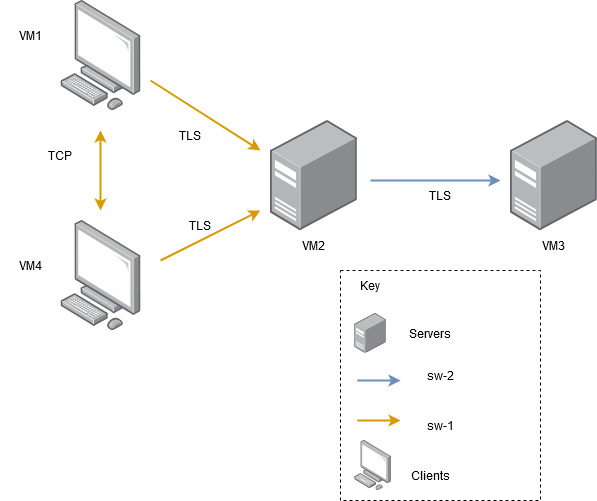

# A34 MessagIST Project Read Me

## Team

| Number | Name              | User                             | E-mail                              |
| -------|-------------------|----------------------------------| ------------------------------------|
| ist1112265  | Daniela Camarinha     | <https://github.com/DanielaDoesCode>   | <mailto:daniela.camarinha@tecnico.ulisboa.pt>   |
| ist1104195  | Sofia Du      | <https://github.com/SofiDu>     | <mailto:sofia.du@tecnico.ulisboa.pt>     |
| ist1103793  | Tomás Gouveia  | <https://github.com/tomas7770> | <mailto:tomas.gouveia@tecnico.ulisboa.pt> |

  


## Contents

This repository contains documentation and source code for the *Network and Computer Security (SIRS)* project.

The [REPORT](REPORT.md) document provides a detailed overview of the key technical decisions and various components of the implemented project.
It offers insights into the rationale behind these choices, the project's architecture, and the impact of these decisions on the overall functionality and performance of the system.

This document presents installation and demonstration instructions.

## Installation

To see the project in action, it is necessary to setup a virtual environment, with 2 networks and 3 machines (and a 4th optional do test E2E capabilities) (similar to the implementation from lab classes).  

The following diagram shows the networks and machines:



[Firewall iptables rules](documents/iptables.md) are present in the documentation of this repository.

### Prerequisites

All virtual machines are running: 
- **Kali Linux on VirtualBox**. You can dowload it from here: [Download](https://www.kali.org/get-kali/#kali-virtual-machines)
- Java version 23
- Maven version 3.8.8
- DuckDB version 1.1.3 - [Download duckdb](https://duckdb.org/docs/installation/?version=stable&environment=cli&platform=linux&download_method=direct&architecture=x86_64) (optional, Maven installs it for you)


### Machine configurations

Inside each machine, use Git to obtain a copy of all the scripts and code.

```sh
$ git clone https://github.com/tecnico-sec/A34
```

Before starting the programs we have to initialize keystores, truststore and certificates for the clients, server and database server. For this, on the root of the project we have the script `generate_certs_stores.sh`
To execute it:
```sh
$ cd sirs-project
$ ./generate_certs_stores.sh
```
If it doesn't work, try this before running the script:
```sh
$ dos2unix generate_certs_stores.sh
```
To apply the firewall rules execute the script for your targetted machine:
```sh
$ documents/iptables_client.sh
```
in this case it's for the client machines.

We used the machines as follow:
- VM1: client
- VM2: server
- VM3: database server

Move the files generated by the script to each of the VMs as follows:

client (VM1):

- client-keystore.jks
- client-truststore.jks

server (VM2):

- server-keystore.jks
- server-truststore.jks

database (VM3):

- database-keystore.jks
- database-truststore.jks

Place the files in the root of the project. The remaining files can be deleted.

To start each machine we have to do the following commands:
1. root of project (in all machines):
```sh
$ mvn clean install
```

2. database (VM3):
```sh
$ cd sirs-project/database
$ mvn clean install
$ mvn clean compile
$ mvn exec:java
```

3. server(VM2):
```sh
$ cd sirs-project/server
$ mvn clean install
$ mvn clean compile
$ export DATABASE_IP=IP of the database
$ mvn exec:java
```
4. client(VM1):
```sh
$ cd sirs-project/client
$ mvn clean install
$ mvn clean compile
$ export SERVER_IP=IP of the server
$ mvn exec:java
```

#### Execution/Demonstration
After setting up the machines and starting them you will turn your focus on to the client machines.<br>
You will be prompted to write a username, password and another recovery password.
After that you are welcomed into the MessagIST main menu!
```sh

  __  __                           _____  _____ _______ 
 |  \/  |                         |_   _|/ ____|__   __|
 | \  / | ___  ___ ___  __ _  __ _  | | | (___    | |   
 | |\/| |/ _ \/ __/ __|/ _` |/ _` | | |  \___ \   | |   
 | |  | |  __/\__ \__ \ (_| | (_| |_| |_ ____) |  | |   
 |_|  |_|\___||___/___/\__,_|\__, |_____|_____/   |_|   
                              __/ |                     
                             |___/                      


-> add contact: type 'a'.
-> send message: type 's'.
-> send end-to-end message: type 'e'.
-> quit: type 'q'.
-> help: type 'h'.
-------------------------
My Contacts: 
-------------------------
Enter an option: 

```

Here, if another client is connected, to send them a message you have to add it as a contact first:
```sh
Enter an option: a
Available contacts:
0->user1
Enter the number of the contact you want to add:
```
write the number of the user you want to add as a contact, in the case we only have one, so it's going to be `0`

Now you can send a message by using the command `s`:
```sh
Enter an option: s
List of contacts:
0->user1
Enter the number of the contact you want to send a message to:
0
Enter the message you want to send:
```
You then write the message you want to send and click Enter! You've sent your first message!

New messages from contacts will appear when you decide to send them a message again, on top of the prompt to send a message.

##### E2E connection
To send a message on Peer-to-Peer mode all you have to do is choose the option `e`:
```sh
Enter an option: e
List of contacts:
0->user1
Enter the number of the contact you want to send a message to:
0
Enter the message you want to send:
hi
```
The flow is exactly the same as in the `s` command.
Screenshots of security mechanisms and potential attack using wireshark are on the REPORT.md [here](REPORT.md)

And this concludes the demonstration!

### License

This project is licensed under the MIT License - see the [LICENSE.txt](LICENSE.txt) for details.

----
END OF README
