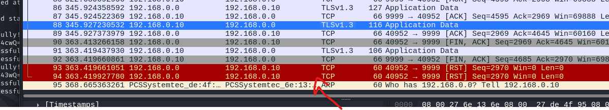
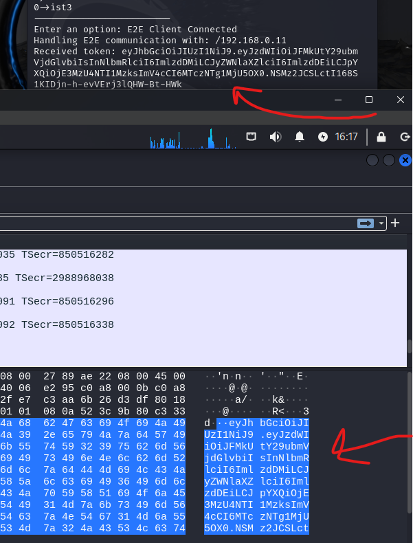

# A34 MessagIST Project Report

## Team

| Number | Name              | User                             | E-mail                              |
| -------|-------------------|----------------------------------| ------------------------------------|
| ist1112265  | Daniela Camarinha     | <https://github.com/DanielaDoesCode>   | <mailto:daniela.camarinha@tecnico.ulisboa.pt>   |
| ist1104195  | Sofia Du      | <https://github.com/SofiDu>     | <mailto:sofia.du@tecnico.ulisboa.pt>     |
| ist1103793  | Tomás Gouveia  | <https://github.com/tomas7770> | <mailto:tomas.gouveia@tecnico.ulisboa.pt> |

## Index

- 1. [Introduction](#1-introduction)
    - 1.1. [Main Components](#11-main-components)
    - 1.2. [Project Architecture](#12-project-architecture)
        - 1.2.1. [Server](#121-server)
        - 1.2.2. [Database](#122-database)
        - 1.2.3. [Client](#123-client)
        - 1.2.4. [Message](#124-message)
        - 1.2.5. [Operation Codes (Opcode)](#125-operation-codes-opcode)
- 2. [Project Development](#2-project-development)
    - 2.1. [Secure Document Format](#21-secure-document-format)
        - 2.1.1. [Design](#211-design)
        - 2.1.2. [Implementation](#212-implementation)
        - 2.1.3. [Public/Private key generation and exchange](#213-publicprivate-key-generation-and-exchange)
    - 2.2. [Security Challenge](#22-security-challenge)
        - 2.2.1. [Challenge Overview](#221-challenge-overview)
        - 2.2.2. [Attacker Model](#222-attacker-model)
- 3. [Conclusion](#3-conclusion)
- 4. [Bibliography](#4-bibliography)

## 1. Introduction

A messaging software called `MessagIST` was designed for IST students to communicate effectively and securely within the IST community.
One of the primary goals of this application is to ensure privacy and security in every communication between users, while complying with GDPR regulations. The application must safeguard these messages from unauthorized access and tampering, ensuring that only the intended sender and receiver can access the content.

To ensure the `confidentiality`, `integrity`, `authentication` and `availability` of the messages exchanged through the platform, we need to design and implement robust security mechanisms alongside a distributed system within our application.

### 1.1. Main Components
- `Secure Documents`: a cryptographic library used to protect the documents (messages);
- `Infrastructure`: a virtual environment consisting of networks and machines, configured with adequate firewall rules, and running application and database servers.
- `Security Challenges`: a point to point encryption mechanism, `Security Challenge A`.

### 1.2. Project Architecture
This project combines a `client-server` architecture with a secure communication channel that enables `peer-to-peer (P2P)` interactions.
The `server` acts as a central hub for data storage, messages exchange and coordination, while the `secure channel` ensures direct and encrypted communication between clients.

All communication is done over `TCP` sockets. `Client-server` and `server-database` communication use SSL. Each component (server, database, and client) maintains its own dedicated `Keystore` and `Truststore`, which are loaded and initialized to configure SSL settings for secure communication.

- `Keystore`: a storage mechanism used to store cryptographic keys and certificates.

- `Truststore`: a storage used to store trusted certificates, including root certificates and other public certificates, that a system uses to verify the authenticity of remote servers or clients.

Direct communication between clients does not use SSL, so that clients don't need to have their own certificates. However, message contents are still encrypted, and a **token** generated by the server provides authentication for clients. See the `Security Challenge` section below for more details.


#### 1.2.1. Server
The server is a `trusted` and `multi-threaded system` that leverages `TLS` to ensure secure `client-server` and `server-database` communication.

- Uses the `SSLServerSocket`, (serverSocket), to accept client connections, spawning a new `MessagistHandlerThread` for each client.
- The `MessagistHandlerThread` class authenticates user credentials (username and password), utilizing a `salt` generated when the user is created for the first time, to protect against **rainbow table attacks**.
- The `SessionManager` class tracks connected users and their sockets. It allows checking user statuses (online/offline) and retrieving the client IP for peer-to-peer communication.
- The `Session` class handles each client connection and manages database server requests using defined operation codes.

#### 1.2.2. Database
The database used in this project is also `trusted` and is an `in-memory system` that should be replicated across multiple machines for improved reliability and availability (note that the provided implementation does not implement replication, relying on a single database server instead).

To ensure the integrity and persistence of data, a `scheduled backup service` is employed. The backup process is managed using a `ScheduledExecutorService` that performs periodic backups of the entire database. Every 14 days, the service triggers a backup operation, storing a copy of the database to the `./backup` directory. This guarantees that all data stored in the database is periodically backed up and can be restored if necessary. 
The database is exclusively responsible for handling `server-side requests` and managing data storage.

- `messages` Table: stores all the messages exchanged between clients.
  
| Column Name | Data Type | Description |
|-------------|-----------|-------------|
| `content`   | TEXT      | The message content (in JSON format, encrypted). |
| `sender`    | TEXT      | The name of the client sending the message. |
| `receiver`  | TEXT      | The name of the client receiving the message. |
| `timestamp` | TIMESTAMP | The timestamp when the message was sent. |

- `clients` Table: stores each client's authentication and cryptographic information.
  
| Column Name | Data Type | Description |
|-------------|-----------|-------------|
| `name`      | TEXT      | The username of the client (unique). |
| `password`  | TEXT      | The hashed password with salt associated with the client. |
| `salt`      | TEXT      | The salt added to the hashed password. |
| `contacts`  | TEXT      | A string representing the list of contacts for the client. |
| `pubkey`    | TEXT      | The client's public key for encryption purposes. |
| `privkey`   | TEXT      | The client's private key, encrypted with a secret key generated with the recovery password. |

#### 1.2.3. Client
The client interface is console-based, offering options to interact with our system.

| Command  | Description |
|----------|-------------|
| `a`      | Add contact. |
| `s`      | Send message in client-server mode.|
| `e`      | Send message in peer-to-peer mode.| 
| `q`      | Quit.|
| `h`      | Help.| 

Each client's username is its own IST ID number (which must start with `ist` followed by numbers), and the user must choose a strong passwords (one for autentication and one for recovering the authenticator).
When users want to start a communication with others (`s` or `e`), they must first add the client to their contact list using the `a` command.

#### 1.2.4. Message
The Message class is responsible for creating and serializing `messages`. Each message is represented as a `JsonObject` and the content field contains an encrypted message.

#### 1.2.5. Operation Codes (Opcode)

`Opcodes` are the API of the system, specifying how clients, server, and database communicate with each other. Opcodes are sent through TCP sockets as follows:

`OPCODE PARAMETER1 PARAMETER2 ...`

Sometimes one or more return values may be sent back.

When a client first connects to the server, the server expects `username` and `hashedPassword` without the need of an opcode.

###### COMMON

| Opcode  | Parameters | Return | Description |
|----------|-------------|-------------|-------------|
| `OK` | N/A | N/A | Operation successful |
| `ERROR` | N/A | N/A | Operation failed |

###### AUTHENTICATION

| Opcode  | Parameters | Return | Description |
|----------|-------------|-------------|-------------|
| `REGISTER_SUCCESS` | N/A | N/A | Register successful |
| `RETURNING_USER` | N/A | N/A | Login successful |
| `INVALID_CREDENTIALS` | N/A | N/A | Invalid credentials trying to login |
| `ERROR_REGISTERING` | N/A | N/A | Error registering user |
| `NO_USERS` | N/A | N/A | Current user has no contacts, or no contacts are available to add |
| `QUIT` | N/A | N/A | Logout |

###### CONTACTS

| Opcode  | Parameters | Return | Description |
|----------|-------------|-------------|-------------|
| `ADD_CONTACT` | `contact_username` | `OK`/`ERROR` | Add a new contact |
| `GET_POSSIBLE_CONTACTS` | N/A | `contacts_list`/`NO_USERS` | Get list of possible contacts to add |

###### MESSAGES

| Opcode  | Parameters | Return | Description |
|----------|-------------|-------------|-------------|
| `SEND_MESSAGE` | `message_json` | `OK`/`ERROR` | Send a message |
| `SEND_E2E_MESSAGE` | `contact` | (`contact_ip` `auth_token`)/`ERROR` | Establish a peer-to-peer connection for end-to-end encrypted messages |
| `GET_MESSAGES` | `contact_username` | `message_count` `message_list` | Retrieve all messages between the current user and another user |

###### E2E

| Opcode  | Parameters | Return | Description |
|----------|-------------|-------------|-------------|
| `VALIDATE_TOKEN` | `auth_token` | `VALID_TOKEN`/`INVALID_TOKEN` | Request server to validate auth token |
| `INVALID_TOKEN` | N/A | N/A | Token is invalid |
| `VALID_TOKEN` | N/A | N/A | Token is valid |

###### DATABASE

| Opcode  | Parameters | Return | Description |
|----------|-------------|-------------|-------------|
| `REGISTER` | `username` `saltedPassword` `salt` | `REGISTER_SUCCESS` | Register a new user |
| `CHECK_CREDENTIALS` | `username` `hashedPassword` | `true`/`false` | Check user credentials |
| `GET_USERS` | N/A | `users_list` | Retrieve a list of all users |
| `GET_CONTACTS` | `username` | `contacts_list`/`NO_USERS` | Retrieve the contacts list of a user |
| `UPDATE_CONTACTS` | `username` `contacts_list` | N/A | Update the contacts list of a user |
| `GET_MESSAGES_FROM_USER_TO_USER` | `username1` `username2` | `message_count` `message_list` | Retrieve all messages between two users |
| `PUT_MESSAGE` | `message_json` | `true`/`false` | Insert a message into the database |
| `CHECK_USER` | `username` | `true`/`false` | Check if a user exists |
| `GET_SALT` | `username` | `salt` | Retrieve the salt for a user |
| `UPDATE_PUBKEY` | `username` `pubKey` | N/A | Update the user's public key |
| `GET_PUBKEY` | `username` | `pubKey` | Retrieve the public key of a user |
| `UPDATE_PRIVKEY` | `username` `privKey` | N/A | Update the user's private key |
| `GET_PRIVKEY` | `username` | `privKey` | Retrieve the private key of a user |

## 2. Project Development

### 2.1. Secure Document Format

#### 2.1.1. Design

To implement encryption and prevent the server from being able to read messages, a library that provides cryptographic security to messages ("documents") is used.


When a client wants to send a message, it starts by protecting it, then sends it through the server (or directly to the recipient, if the peer-to-peer option is used), and the recipient unprotects it.

The library provides the following operations:

- `protect(PublicKey recipientKey, PrivateKey senderPrivateKey, PublicKey senderPublicKey)` - Adds security to a document.

- `check(PublicKey senderKey)` - Verifies if the message was written by the sender and not tampered by someone else (returns `true` if the check passes, `false` otherwise).

- `unprotect(PrivateKey recipientKey, PublicKey senderKey, boolean useSenderKey)` - Removes security from a document. A validity check is also performed (similar to the `check` operation), and the operation fails if the check fails. If `useSenderKey` is `true`, the `recipientKey` is assumed to be the sender's private key. This is used when the message is read by its sender.

Message protection is provided by encrypting its contents with an **AES secret key** only known by the sender and recipient. This ensures that only these clients can read the contents (**SR1**).

Each message has its own secret key, randomly generated upon protecting it, to prevent contents of other messages from being compromised if a single message's key is compromised. Because of this, secret keys are sent and stored along with the message. They are encrypted using the recipient's public key, so that only the recipient can decrypt them (**SR4**), and therefore decrypt the message. A copy of the key encrypted with the sender's public key is also stored, to allow the sender to read messages they sent.

In addition, the encrypted message is **digitally signed** with the sender's private key (using the `SHA256withRSA` algorithm), verifying that the received message was indeed written by the sender (**SR2**).

The format of an unprotected document is as follows (JSON):

```json
{
    "message": {
        "sender": "ist1123123",
        "receiver": "ist1321564",
        "timestamp": "2022-01-01T12:00:00Z",
        "content": "Hi! do you know the solution for the SIRS exercise?"
    }
}
```

And a protected document:

```json
{
    "message": {
        "sender": "ist1123123",
        "receiver": "ist1321564",
        "timestamp": "2022-01-01T12:00:00Z",
        "content": "MIQfb5dLFkroJnfeP2lMrp80hegs...",
        "keyForReceiver": "eQr+qAtLjZcdusC2Qd3Y/...",
        "keyForSender": "ldtZhtjVpwReY351mffAav/...",
        "signature": "YRsoxCAS9RrlSFcYJAu/..."
    }
}
```

Note that the encrypted content, keys, and signature are encoded in Base64 to facilitate storing them in a text format.

#### 2.1.2. Implementation

The Secure Document library is implemented in Java, in a single class `SecureDocument`. Java's built-in `java.security` and `javax.crypto` are used for cryptography. Google [GSON](https://github.com/google/gson) is used for reading and modifying messages in JSON.

A secure document is created using the `SecureDocument(String message)` constructor, where `message` is a message in the format specified above, unprotected or protected. The resulting secure document object can then be used to protect, check, or unprotect messages, by calling the respective methods. After protecting/unprotecting, the modified message can be obtained by calling `getMessage()`, which returns a `String` of the message in JSON.

A command-line tool known as "Secure Document Tool" is included with the project to easily test interaction with the library. It takes message JSON files as input, and outputs the modified message after protecting/unprotecting, or the result of a `check` operation. More detailed instructions are included in a help message within the tool.

#### 2.1.3. Public/Private key generation and exchange

Although generation of clients' public/private keys and their exchange is not part of the Secure Document library, it's required for it to be properly used.

When logging in for the first time, the user is prompted to enter a recovery password. Using `PBKDF2WithHmacSHA256`, a secret key is derived from this password and the user salt. A random `RSA` key pair is also generated. The private key is encrypted with the secret key, and the key pair is sent to the server to be stored. For a given password, the secret key is always the same, so that the user can recover messages (**SRA3**). Although storing the private key in the server (even encrypted) weakens security, it improves usability for this application. Originally, we considered generating an `RSA` key pair directly from the password, however we found out it wasn't feasible with the libraries used.

Whenever a client needs to obtain the public key of another client, they simply need to retrieve it from the server, which we assume to be trustworthy enough to authenticate users.

### 2.2. Security Challenge

#### 2.2.1. Challenge Overview

###### Challenge A - security requirements

- `[SRA1: Confidentiality]` : This was solved by using the `SecureDocument` class (Explained above).
  
- `[SRA2: Confidentiality]` :
  For this requirement, we assumed that a side channel would be a new connection directly between two clients. Neither of the clients are authenticated by a CA (Certification Authority) so without any more mechanisms we cannot for sure now if they are to be trusted.
  To solve this we decide to implemented a `Token Service` System: Whenever a clients wants to send a `E2E Connection` (End-to-End), it requests a Token from the Server, which is the trusted authority in the system, serving the server as a broker of Tokens. These are in the format of `JWT` - JSON Web Tokens. And these have the goal of asserting claims, in our case we want the receiving client to know the sender is an authenticated user of the MessagIST system. To do this, the sender requests a Token to the server, and the sender sends that token, alongside the actual message to the receiver. After receiving the token, the receiver sends it to the server for validation. If the token is valid the server validates it and the receiver stores the message sent by the sender.<br>
The Token has the following properties:
  ```
   return Jwts.builder()
                .setSubject("E2E-connection")
                .claim("sender", sender)
                .claim("receiver", receiver)
                .setIssuedAt(new Date())
                .setExpiration(new Date(System.currentTimeMillis() + 60000)) // 1 min expiry
                .signWith(config.getJWT_KEY())
                .compact();
  ```
  -- Where the claims `sender` and `receiver` are their respective IDs.
  -- The `.setExpiration` is set to deal with replay attack, by setting a time of validity of the Token, it shortens the window of vulnerability of the system, so that attackers are not able to use the Token and pretend to be an autorized communication entity.
  -- The token is then signed with a Key from the Server, and this is what makes it possible for the server to validate the token.
  To accept peer-to-peer connections we also implemented the following classes: `E2ECommunicationHandler.java`, `E2EConnectioListener.java`. And to store the messages: `ClientLocalStorage.java`

  Flow of execution diagram:<br>
  
  
  
- `[SRA3: Availability]` :
  For this requirement, we are only storing data locally for the E2E communication (from the last challenge point). And this is done through a local instance of the database that stores the message as they are sent out and as they arrive. Since it is a Peer-to-Peer type of communication with an authenticator entity (the server) we don't see much sense in having a recover mechanism for those messages.
  We have, however, implemented a `PasswordDerivationService`, that generates a key from a password (written by the client on login), This key is used to get the message history of the client and without it the client cannot retreive it.


#### 2.2.2. Attacker Model

##### Trusted Authorities 
- `MessagIST Server`
The Server has it's own certificate signed by a CA (Certification Authority) generated by the `generate_certs_stores` script.
Its certificate is put into every clients TrustStore, making it a trusted entity by all clients in the network.<br>

- `Database Server`
The database is also a trusted entity, but it's only connected directly to the Server, and so the server is the only one that has the database certificate in its TrustStore.

##### Partially Trusted Authorities
In a Peer-to-Peer connection between clients, none of them are trusted unless they have successfully sent out a valid token, and they only become trusted for the purpose of accepting their message.
After that, the client who sends the message has to generate another token and repeat the process to become trusted by the receiver again. Hence, it being Partially Trusted.


##### Untrusted Authorities
Any machine that sends out an invalid token or that is not part of the permitted IPs by the iptable Firewall rules.


#### Attacker Power
 - **Things the attacker know how to do:** We assume the attacker know how to use Wireshark to try to snoop packets. That they also know how to setup a that can connect to the network and try to connect to our system.
 - **Things the attacker does not know how to do:** We assume the attack does not have access to our system directly, that he is not capable of interfering with its runtime and therefore not be able to see the flow o execution nor the in-memory data that is being used by the database.

#### Possible atacking scenarios
 -- Wireshark
 on VM4 we turned on an instance of Wireshark to check if any attacker could see the contents of the message we were sending and the login process.

 ##### Login Process
 - A clients starts its instance and the SSL handshake starts:<br>
 

 - The client types its username - we can see that since it's a TLS connection, the payload is encrypted:<br>


- Another 2nd client connects and disconnects:<br>
 

- On a E2E Communication we can see the clear Token (since this is not a secure connection):<br>
 

- Nevertheless, when the client get's validated the content of the message is still encrypted:<br>
 
 
 


#### Firewall
To minimize the access of the malicious actors into our network we implemented `iptable` firewall rules, that are designed to only permit the minimum IPs possible for the system to function without failure.
[Check them here](documents/iptables.md)

## 3. Conclusion

To conclude, we were able to establish SSL/TLS connections safely between clients and server, server and database.
We were able to securely encrypt the content of the messages with the use of the `Secure Document` tool, authenticate sender and receiver and check the integrity of the messages.
We were able to establish peer-to-peer connections over an insecure network with the validation of an authenticated entity.

We were able to store keys and certificates safely with keyStores and trustStores

##### Requirements fulfilled:
 - [SR1: Confidentiality] Only the sender and receiver of a message can see its content. **YES** - SecureDocument Class
 - [SR2: Integrity 1] The receiver of a message can verify that the sender did wrote the message. **YES** - SecureDocument Class
 - [SR3: Integrity 2] It must be possible to detect if there is a missing message or if they are out of order. **YES** - By using TLS under TCP, it allows us to assume no messages will be discarded
 - [SR4: Authentication] Messages are only send to their authenticated recipients. **YES** - By securing that clients are authenticated through the TLS connection.
 
   Security Challenge:<br>
   
 - [SRA1: Confidentiality] Only sender and receiver can see the content of the messages. **YES** Secure Document Class
 - [SRA2: Confidentiality] There must be a protocol that allows two students to exchange a key (in a secure way). You can assume the existence of a side channel for this. **YES** TokenService and `E2ECommunicationListener` and `E2ECommunicationHandler`
 - [SRA3: Availability] If a user loses their phone, they must be able to recover the message history. More or Less (there is no local message history for normal chats, but the recovery mechanism is there 😁)


##### Possible enhancements:
One of the possible enhancements would be the addition of the local message logs for each client of all of the message types. This would allow to minimize traffic to the server to receive the chat history everytime a user logs in or requests to send a message.

This project allowed us to develop our critical analysis of system regarding how secure they are, and broaden our knowledge of the different possibilities to make a system secure.

## 4. Bibliography
Alex Yu, System Design Interview,ByteByteGo, 2020 [here](https://www.amazon.com/System-Design-Interview-insiders-Second/dp/B08CMF2CQF)


----
END OF REPORT
